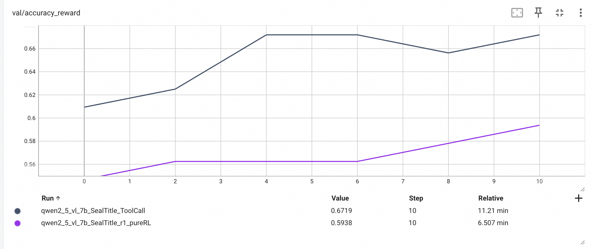

We modify EasyR1(https://github.com/hiyouga/EasyR1) to support flexible toolcall in our OCR task.
- ReAct rollout
- actor update mask
- ...


Train each for 5 epochs. The experimental results are shown in the figure below:  
  


Note that, for sampling efficiency in toolcall, we set the `max_tokens` limitition in  xx(./verl/workers/rollout/vllm_rollout_spmd.py) . Please set suitable values for your own tasks.
Note: To limit sampling overhead during tool-call rollout, we hard-code  `max_tokens` in first recognition stage [verl/workers/rollout/vllm_rollout_spmd.py](verl/workers/rollout/vllm_rollout_spmd.py); please adjust it to a value that best suits your task.

```python
stop_signal = '</function>' # rl toolcall,  table </function> ; seal </think>\ 
# TODO For efficient sample. You can set your own max-tokens. Or simply set `first_max_tokens = second_max_tokens = self.config.response_length`.
first_max_tokens = 2048
second_max_tokens = max(self.config.response_length-first_max_tokens, min(4096, self.config.response_length) )
``` 

