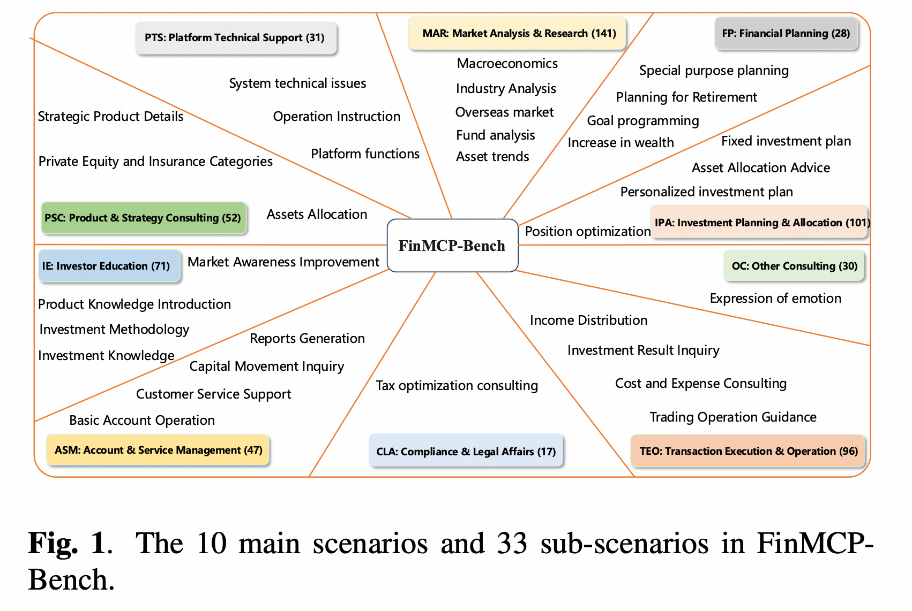

<h1 align="center"> DianJin-TIR Model Training, Evaluation, Benchmark </h1>

<p align="center">
    
</p>

<h3 align="center">DianJin TIR Model</h3>
<h4 align="center">DianJin TIR — 金融 MCP 工具调用大模型</h4>

本篇README.md面向开发者和用户


## 目录

- [使用指南](#使用指南)
  - [开发前的配置要求](#开发前的配置要求)
  - [安装步骤](#安装步骤)
- [文件目录说明](#文件目录说明)
- [Benchmark](#Benchmark数据)
- [训练](#模型训练)
  - [tokenization](#1-训练数据-tokenization)
  - [train](#2-模型训练)
  - [merge](#3-lora-合并为-hf-格式)
- [评测](#模型评测)
  - [infer](#1-inference)
  - [eval](#2-evaluation)
- [贡献者](#贡献者)
- [鸣谢](#鸣谢)

### 使用指南

在使用本项目代码前需要准备好模型接口，MCP Server URL


###### 开发前的配置要求

```sh
CUDA>=12.2
python=3.12
pip install --no-deps -r requirements.txt
```

###### **安装步骤**

1. 从  [qieman 官网](https://qieman.com/) 获取 MCP Server URL、 MCP_SCHEMA ([且慢 MCP Tools](https://qieman.com/mcp/tools))

2. 克隆本项目


### 文件目录说明

```

Root
├── Benchmark
│   ├── benchmark_fig.png
│   ├── benchmark_final.json
│   ├── benchmark_multi_turn.json
│   ├── benchmark_stms.json
│   └── benchmark_stss.json
├── eval
│   └── evaluation.py
├── infer
│   ├── demo_infer.json
│   ├── infer_config.yaml
│   ├── inference_api.py
│   └── inference_hf.py
├── train
│   └── sft
│       ├── lora_merge
│       │   └── merge_script.py
│       ├── lora_train
│       │   ├── ds_zero3_offload.json
│       │   ├── sft_config.yaml
│       │   ├── tokenization.py
│       │   ├── train.py
│       │   └── train_zero3.sh
│       └── train_data_demo.json
├── README.md
└── requirements.txt

```


### Benchmark 数据
金融行业首个基于MCP的真实场景Benchmark(FinMCP-Bench数据可在[URL](https://huggingface.co/DianJin)获取)

数据如下:

* 三合一数据: benchmark_final.json

* 单轮单步: benchmark_stss.json

* 单轮多步: benchmark_stms.json

* 多轮多步: benchmark_multi_turn.json





**部分参数解释:**
```
scenery: 业务场景（一级-二级-...）
diff_level: {
            "turns": 轮数,
            "tool_number": ground truth 工具调用数,
            "para_tool_call_number": 并行工具调用数
            "level": 难度等级
        },
tool_list: 所用工具列表
messages: 经金融领域专家检验过的工具调用 ground-truth 过程
```

### 模型训练
我们提供了 sft 训练样例，所用配置参数，详见 [sft_config](./train/sft/lora_train/sft_config.yaml)

#### 1. 训练数据 tokenization 
```sh
cd train/sft/lora_train
python tokenization.py
```

#### 2. 模型训练

```sh
bash train_zero3.sh
```

#### 3. lora 合并为 hf 格式
```sh
cd train/sft/lora_merge
python merge_script.py --base_model_path=your_base_model --lora_checkpoint_path=your_lora_path --output_dir=your_merge_model_path
```

### 模型评测

#### 1. inference
我们提供了 inference 代码样例，所用配置参数，详见 [infer_config](./infer/infer_config.yaml)

**数据格式**见 [推理数据样例](./infer/demo_infer.json) (需含 messages （query | history conversations）) 

**推理数据样例** 格式与 [benchmark 数据](./Benchmark/) 一致, 可直接对 benchmark 数据进行推理.

推理后，模型输出存于  `messages_pred` 字段. 

(i) 基于 API （**RECOMMENDED**）
```sh
cd infer
python inference_api.py
```
* 若对本地模型进行推理，推荐通过 `vllm` , `sglang` 等框架，部署后基于 API 推理

(ii) 基于 HF model 
```sh
python inference_hf.py
```


#### 2. evaluation
对 Inference 后的数据 (含 `messages_pred` ) 进行评测. 

```sh
cd eval
python evaluation.py --eval_data_path=your_answer_save_path
```


### 贡献者

Jie Zhu, Yimin Tian, Boyang Li, Xianyin Zhang 


### 鸣谢
- [盈米基金](https://qieman.com/)
- [trl](https://github.com/huggingface/trl)
- [peft](https://github.com/huggingface/peft)

